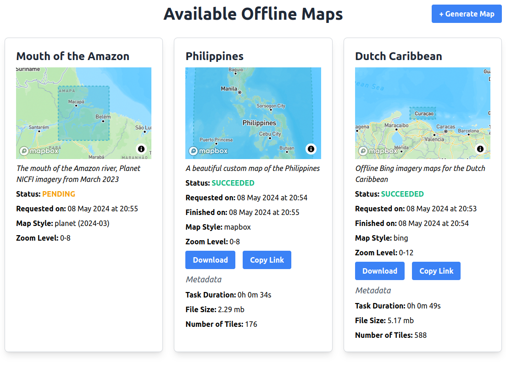
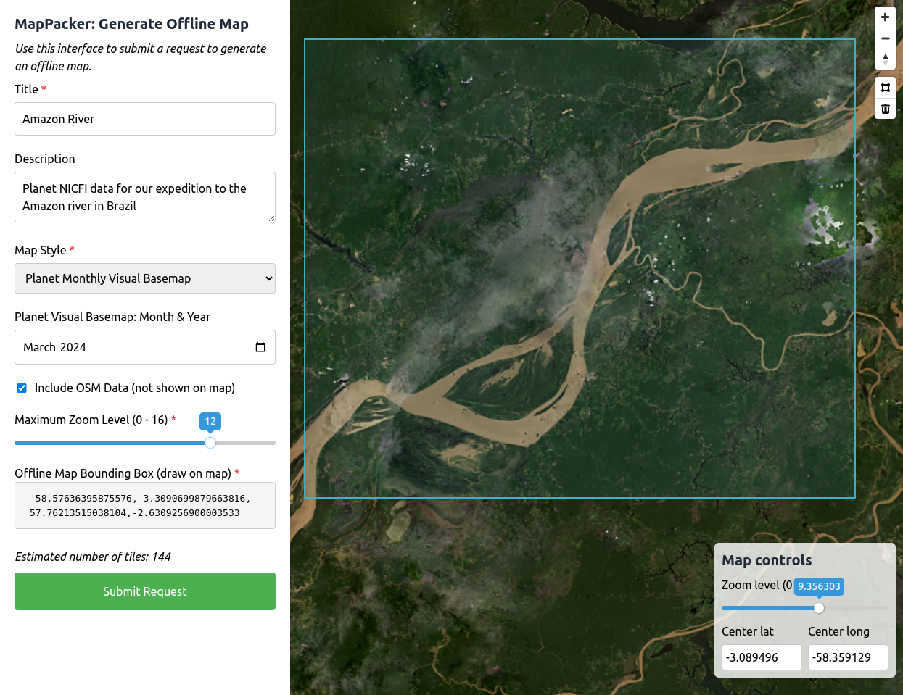

# mapPacker

MapPacker is a service that communities and other users can utilize to generate offline map resources (raster mbtiles) to use in field data collection applications like Mapeo and ODK/Kobo Collect. MapPacker provides a user interface to manage, access, and download offline basemaps for field mapping or monitoring, for a given area of interest.

MapPacker is a Nuxt.js application with two primary views, accessible to the user once they have authenticated per the chosen authentication strategy:

1. A **Map Dashboard** to manage and access existing map offline requests, where the user can see the status (succeeded / pending / failed) of the request, information and metadata about the request, and if succeeded, links to download or copy the offline map file.



2. A **Generate Map** view, where the user can submit an offline map request by drawing a bounding box on a map for their area of interest, selecting a map style, and adding a title and description for their offline map request.



Once submitted, MapPacker will write the request to a Postgres database table and submit the request to a message queue. For the MapPacker flow to work, [mapgl-tile-renderer](http://github.com/conservationMetrics/mapgl-tile-renderer/) needs to be deployed as a task worker and set up to continuously listen to this message queue for new requests, and update the same Postgres database table with the render result.

## Configure

To get started, configure your MapPacker application environmental variables as shown in `.env.example`:

**Database:** Provide your database information in the relevant variables, including the table where offline map data is stored.

**Message Queue:** Provide your message queue variables to publish your map request to a storage queue service, where it can be picked up by a [mapgl-tile-renderer](http://github.com/conservationMetrics/mapgl-tile-renderer/) task worker. For Azure, you need a queue name, a storage account name, and a storage account key.

**Authentication strategy:** MapPacker supports three different authentication strategies: auth0, password (from an environmental var) with JWT key, or none. Set your authentication strategy in `NUXT_ENV_AUTH_STRATEGY`.

- If you are using an auth0 strategy, then you need to provide a domain, client ID, client secret, audience, and base URL.
- If you are using a password strategy, then you need to provide a password, and secret JWT key.

**Vue API key:** Generate an API key to add to request headers made by the Nuxt front end.

**Map config:** Provide the default settings for the map zoom level and lat/long coordinates. You may also provide a custom Mapbox map style to be used in the application (if not, Mapbox Streets will be used as the default option).

**Mapbox, Planet, Stadia, and Thunderforest access tokens:** Provide access tokens to be used across the application for authenticating with map assets. If not provided, the respective map styles will not show in the generate map view.

**Offline map storage:** Provide a URI where the offline maps can be downloaded, as well as a path pointing to a volume mount directory for mapgl-tile-renderer to store the files.

## Build Setup

```bash
# install dependencies
$ npm install

# serve with hot reload at localhost:3000
$ npm run dev

# build for production and launch server
$ npm run build
$ npm run start

# generate static project
$ npm run generate
```

Add `--hostname 0.0.0.0` if you want the app to be accessible across your local network.

## Deployment

For deployment (e.g. on Azure), the following additional env vars are needed:

```
HOST: 0.0.0.0
NODE_ENV: production
```

Local deployment of Docker:

```sh
docker run --env-file=.env -it -p 8080:8080 map-packer:latest
```
